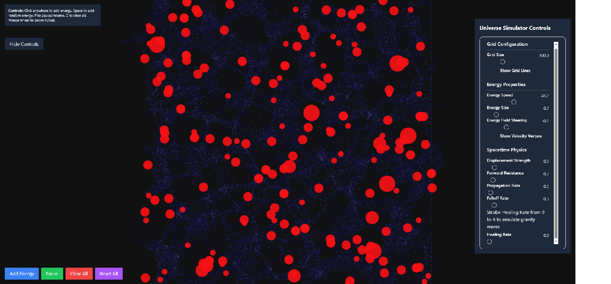

# Fractal-Universe-PoC

Fractal Universe Proof-of-Concept

Patent Pending

This software comes with a limited license. Please review the [LIMITED_LICENSE](LIMITED_LICENSE) file.

This is a Fractal Universe Simulation that runs as a web server. It is able to model a surprisingly large number of
behavior in the Universe, giving strong evidence to a fractal pattern. Other behaviors can be inferred from
the shape of spacetime displacement. In the future, an ideal simulator would be able to simulate photons,
inducing charged particles, etc.

The fractal universe simulator is based on a simple theory:

- The Universe is a fractal
- It consists of energy and spacetime. The structure of spacetime is set by energy
- Energy is a structure of energy (recursive definition)
- Energy displaces spacetime as it propagates through it
- Spacetime steers energy
- The lateral displacement of spacetime (or rather, the underlying energy) induces opposing spin. This spin becomes
  particle properties such as charge, spin, etc.

From this, a continous stack of directed fields manifests. At different scales, aggregations, harmonics, and pressures
emerge that create the field behavior.

This is a theory I developed myself. A fractal universe theory isn't new, but I haven't encountered anyone attempting
to describe a specific mechanism as I am doing here.

This also doubles as general purpose directed field simulator, in case you have the need for it.

In my opinion this is crude and is intended to demonstrate the concept - much in the same way a petri dish and bacteria can demonstrate evolution. For example, you can only zoom in and out, and there's no way to paint fields, template energy structures, save presets, etc.

## How to Start

If you already have a github account simply create a codespace.

In VS Code:

- Run the task "install dependencies"
- Run the "run configuration" "Debug npm run dev"

## Usage

Thus, there's a bunch of knobs around this. There's no wrong answer. Certain ranges are a sweet spot for stability.

To move towards cosmic scale on the fractal:

- Turn healing rate to 0 or near 0. Reduce displacement and propagation rate. Reduce speeds.

To move twoards quantum scale on the fractal:

- Increase displacement strength, forward resistance, reduce propagation rate, increase falloff rate, and increase healing rate

You'll find that certain configurations are much more stable than others. It is my belief there's an intrinsic mechanism that
encourages finding stability (where things form orbits). I suspect orbits create resonating frequencies which then lock in the next step on the fractal.

Energy is a point abstraction. In an actual simulator, it would need to be volumetric and truely displace spacetime. Instead, it uses
points and crude effects. Large energy is especially badly done, and there's no harmonics to fling energy apart. The best way to
simulate energy instability is to just have a lot of energy floating around.

Energy field steering is special - it's a "what-if" where if you turn it negative you get gravity, and if you turn it positive you get anti-gravity.
Basically, when energy encounters slanted spacetime, does it turn towards the slant (gravity) or turn away (anti-gravity)? If you think about it,
it actually makes a lot of sense we wouldn't detect something that actively repels the very thing we attempt to detect it with.

You can also emulate a rotational skew coming from a parent field. This causes the energy to have a rotation bias.

I also accidentally created the speed of light at one point. Basically, when energy was displacing spacetime forward and treating it like
resistance, it would always slow down (or speed up) to the same speed. This incidentally also created warp speed energy in uncommon scenarios due to the unlocked speed. I'm still not
100% sure it was actually a real thing or bug that I overlooked. Remove the speed normalization to give it a try. It doesn't slow down quite like
it used to due to many physics changes and fixes since I took it out. I guess if we discover that 1% of light travels at a different speed then we'd know.

Below is an example of a stable molecule created using the simulator. It resists a large range of pressure changes (with reference values in the screen shot).

